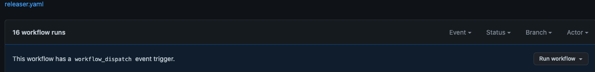
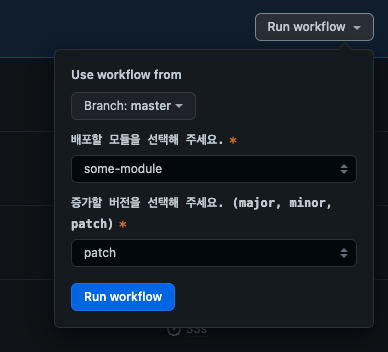
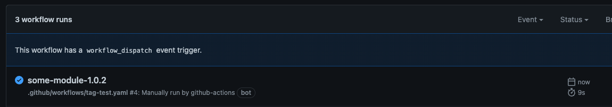
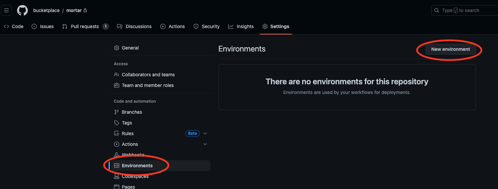
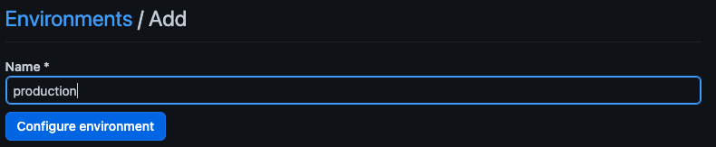
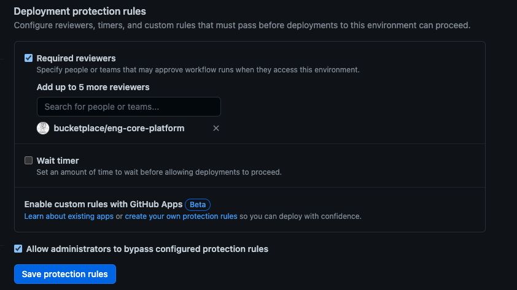
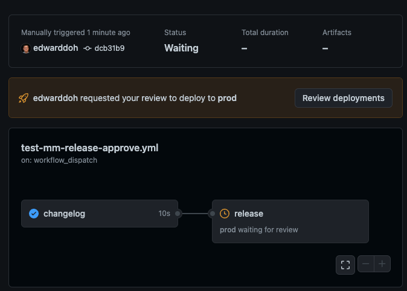
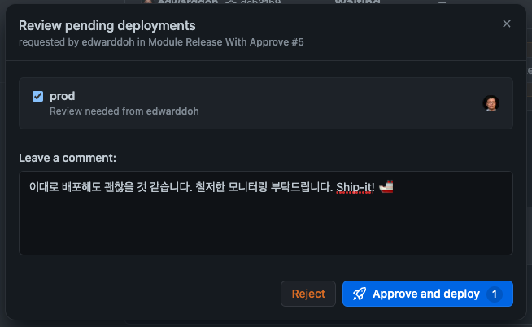

# Multi Module Releaser
패키지에 하나 이상의 모듈이 있을때 릴리즈를 도와주는 github action 입니다.
본 액션의 기능은 아래와 같습니다.
 - `module/<module-name>` 태그가 붙은 PR만 수집하여 ChangeLog를 생성
 - bump를 SemVer의 다음 버전을 생성 (major, minor, patch)
 - 위 두가지 정보를 활용하여 Release 생성
 - `workflow-file` 옵션 제공시, 실제 릴리즈를 실행할 수 있는 workflow 실행


## 설치
multi module 설정은 즉시 릴리즈 실행과, Changelog 검토 및 승인 방식 두가지 형태로 사용가능하도록 구성되었습니다.
### 즉시 릴리즈 실행

Action은 아래와 같이 설정하여 사용 가능합니다.

```yml
# .github/workflows/module-release.yml

name: Module Release

on:
  workflow_dispatch:
    inputs:
      module:
        type: choice
        description: '배포할 모듈을 선택해 주세요.'
        required: true
        default: 'some-module'
        options:
          - 'some-module'
          - 'other-module'
          - 'more-module'
      bump:
        type: choice
        description: '증가할 버전을 선택해 주세요. (major, minor, patch)'
        required: true
        default: 'patch'
        options:
          - 'major'
          - 'minor'
          - 'patch'

jobs:
  release:
    runs-on: ubuntu-latest
    permissions:
      contents: write
      actions: write
      pull-requests: read
    steps:
    - uses: actions/checkout@v3
    - name: 'Release Module'
      id: release_module
      uses: bucketplace/ci/.github/actions/multimodule-releaser@latest
      with:
        module: ${{ inputs.module }}
        workflow-file: '${{ inputs.module }}-deploy.yml'
        workflow-inputs: '{"name": "james"}'
        bump: ${{ inputs.bump }}
        latest: true
```

위의 액션을 생성, 액션메뉴로 들어가면 Action run history 목록 상단에 `Run workflow` 버튼이 생성됩니다.


이 버튼을 누르고 모듈과 Bump 옵션을 선택하면 버전이 하나 올라간 새로운 릴리즈가 생성됩니다.


예를 들면 `some-module` 및 `patch` 선택시, 이전에 `some-module-1.0.0` 버전이 있었다면  `some-module-1.0.1` 버전으로 릴리즈가 생성되고 `module/some-module` 라벨이 붙은 PR들을 모두 수집하여 Changelog를 만들어 줍니다.

일반적으로 이 액션 이후 step으로 이어서 실제 배포 작업을 진행해도 되지만 이렇게 할 경우 workflow run의 이름이 모두 같은 문제가 발생한다.
따라서 이후에 아래와 같은 배포용 workflow를 따로 제작하여 실행하면 조금 더 유용하게 활용할 수 있다. (추가로 approve 등의 작업도 가능하다.)

```yml
# .github/workflows/some-module-deploy.yml

name: Deploy some-module
run-name: ${{ github.ref_name }}

on:
  workflow_dispatch:
    inputs:
      name:
        type: string
        required: false
        default: ""

jobs:
  hello-world:
    runs-on: ubuntu-latest
    steps:
    - id: hello
      run: |
        echo "hello ${{ inputs.name }}!!"
```

아래와 같이 버전명으로 workflow run History가 생성된다.


## Changelog 검토 및 승인
첫번째 방식처럼 모듈 정보와 version bump만 가지고 릴리즈를 실행하면 어떤 변경사항이 릴리즈에 포함되는지 알기가 어려우므로 배포시점에 조금 불안할 수 있습니다. 특히 배포전 Changelog를 검토하고, 변경사항에 대해서 팀내, 혹은 Stakeholder에게 승인을 받아야 하는 경우라면, environment approval을 활용하는 이번 섹션을 참조하면 좋습니다.

먼저 검토 및 승인을 위해서는 environment 설정이 필요합니다. 배포용 environment 와 관련해서 자세한 내용은 [이 문서](https://docs.github.com/en/actions/deployment/targeting-different-environments/using-environments-for-deployment)를 참조하세요.
여기서는 간단하게 환경 설정과 승인 등록절차를 간단한 스크린 샷과 함께 아래에 제공합니다.
- 먼저 설정하려는 저장소의 Setting > Environments 메뉴를 선택합니다.

- 다음 원하는 배포 환경을 설정합니다. 여기서는 일반적으로 production을 사용합니다.

- 다음 Deployment Protection rules에서 적절한 approver(reviewer) 그룹/개인을 설정합니다.

- save protection rules 버튼을 꼭 누릅니다.

이렇게 설정하고 아래와 같이 action을 설정합니다.

```yml
# .github/workflows/module-release.yml

name: Module Release

on:
... # on 구문은 1번 방식과 동일

jobs:
  changelog:
    runs-on: ubuntu-latest
    outputs: 
      next-tag: ${{ steps.changelog.outputs.next-tag }}
      changelog: ${{ steps.changelog.outputs.changelog }}
    permissions:
      contents: write
      pull-requests: read
    steps:
    - uses: actions/checkout@v3
    - id: changelog
      uses: bucketplace/ci/.github/actions/multimodule-changelog@latest
      with:
        module: ${{ inputs.module }}
        bump: ${{ inputs.bump }}
  release:
    needs: changelog
    runs-on: ubuntu-latest
    environment: production
    permissions:
      contents: write
      actions: write
    steps:
    - uses: actions/checkout@v3
    - id: release
      uses: bucketplace/ci/.github/actions/release-and-dispatch@latest
      with:
        next-tag: '${{ needs.changelog.outputs.next-tag }}'
        changelog: '${{ needs.changelog.outputs.changelog }}'
        workflow-file: '${{ inputs.module }}-deploy.yml'
        workflow-inputs: '{"name": "james"}'
        latest: true
```

첫번째 changelog job에서 발행한 버전과 changelog를 Workflow Job Summary에서 볼 수 있고, 두번째 Job(release)에서 배포를 진행합니다. 이때 release job은 `environment: production` 설정이 들어 있으므로, 위에서 설정한 approver의 승인을 기다리게 됩니다.

승인자는 아래와 같은 화면을 볼 수 있고,

`Review deployments` 버튼을 누르면 다음과 같은 창을 통해 승인을 진행할 수 있습니다.


## **🚨 주의점**
### 최초 버전
본 액션은 항상 기존에 Release 된 버전을 기준으로 하나 증가하여 배포합니다. 따라서 반드시 같은 형식의 버전 Release가 이미 최소 하나는 있어야 합니다. 예를 들어 Module 명이 `some-module`이고 version 이 `1.0.0` 부터 시작이라면 본 Action을 사용하기 전 반드시 `some-version-1.0.0` 과 같이 이전 태그 및 릴리즈가 이미 배포되어 있어야 오류가 나지 않습니다. 최초 버전은 수동으로 릴리즈 해주시길 부탁드립니다.

## Inputs
| **Input**         | **Description**                                                                                                                                     |
| ----------------- | --------------------------------------------------------------------------------------------------------------------------------------------------- |
| `module`          | 빌드하고자 하는 모듈 명, 버전의 Prefix로도 사용된다. 필수 옵션이다.                                                                                 |
| `workflow-file`   | 실제 배포가 진행되는 workflow 파일 경로, 없을 경우 추가 workflow 를 실행하지 않는다                                                                 |
| `workflow-inputs` | 실제 배포가 진행되는 workflow에 전달할 Input, Json string 형태이며, 없을 경우 input을 전달하지 않는다.                                              |
| `bump`            | SemVer 버전의 어떤 파트를 올릴지 선택하는 옵션. 필수이며 기본값은 `patch` 이다. (`major`, `minor`, `patch` 중 택 1)                                 |
| `latest`          | 릴리즈 시에 해당 릴리즈를 latest로 만들 것인지에 대한 선택. 기본값은 false 이다.                                                                    |
| `divider`         | Tag명을 결정할때 Prefix 와 Version 사이에 구분자. 기본값은 `-` 이며, 경우에 따라 변경 가능하다 (`/v` 일 경우 some-module/v1.0.0 형태로 버전이 생성) |
| `date-suffix`     | Release 를 등록할때 이 값이 있으면 `@YYMMDD` 형태의 날짜 정보를 suffix로 추가해준다.                                                                |


## Q & A
1. 왜 다른 Workflow를 부르는 기능을 권장하는지 궁금합니다. 그냥 job을 하나 더 추가하면 될 것 같은데요?
   - 안타깝게도 Github는 Workflow run 중간에 workflow run의 이름을 변경하는 것을 허용하지 않습니다. 그래서 Release event와 달리 `Run workflow`를 이용해서 버전을 결정한 경우에는 workflow run history의 이름이 모두 같은 문제가 생깁니다. 따라서 workflow run history 만으로 버전을 구분하기가 어려워 지는 문제가 발생합니다. 따라서 다른 workflow를 새로운 버전의 ref와 함께 호출함으로써 버전을 알 수 있는 workflow run을 새로 생성할 수 있습니다.
